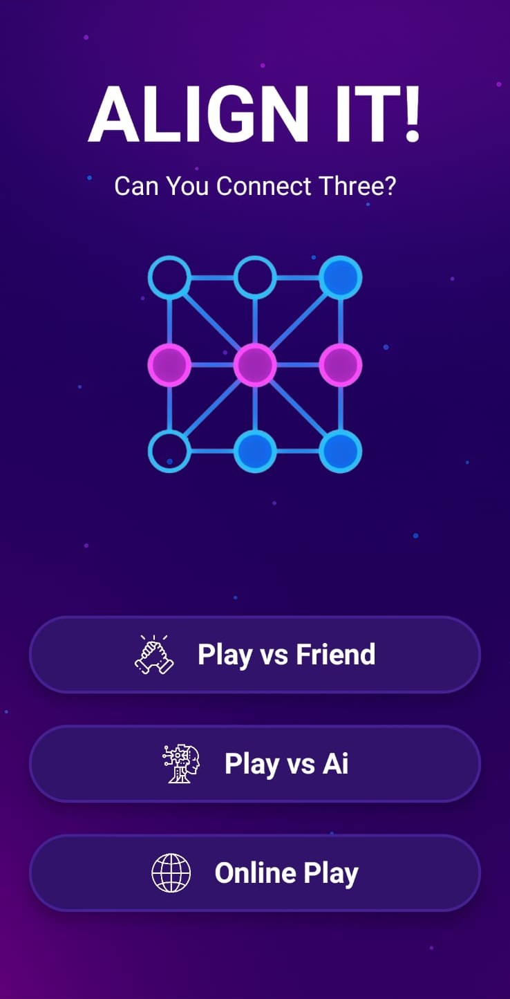
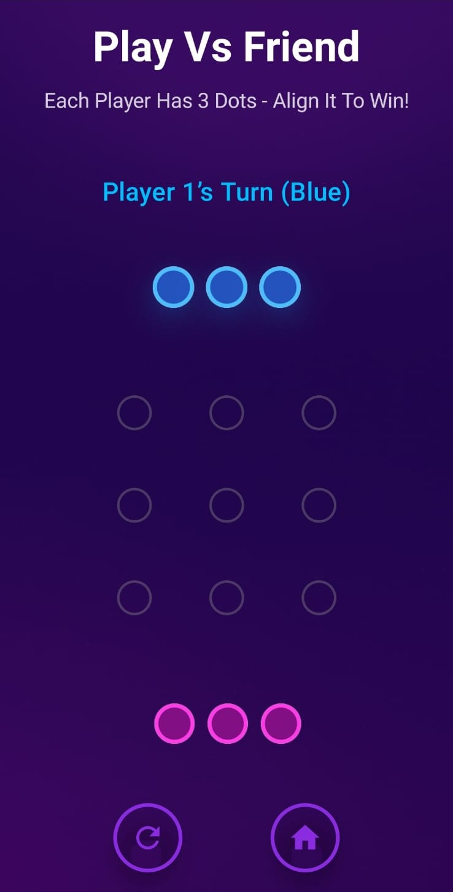
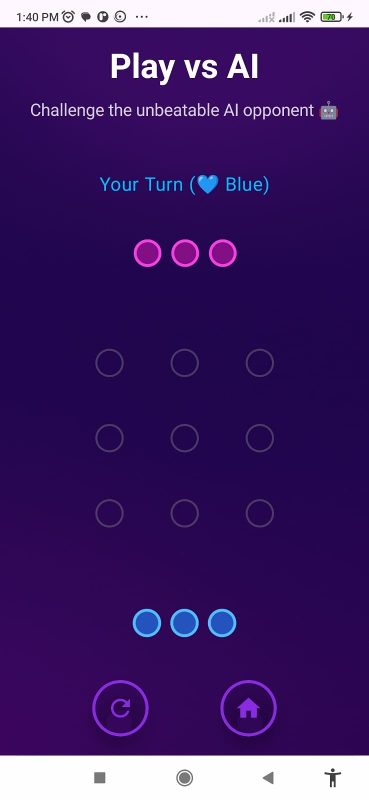

# 🎮 Align It  

**Align It** is a fun and strategic two-player game built entirely using **Jetpack Compose**.  
Players take turns placing colored dots on a grid — the first to align their dots horizontally, vertically, or diagonally wins! 🏆  

---

## 🕹️ Gameplay  

- Two players: **Blue (🟦)** and **Pink (🩷)**.  
- Players take turns placing dots on the grid.  
- The game automatically detects when a player wins.  
- Choose between:
  - 👬 **Play vs Friend** — Local two-player mode.  
  - 🤖 **Play vs AI** — Challenge the built-in AI opponent.  
- Clean and minimal interface with smooth animations.  

---

## ✨ Features  

✅ Interactive grid board  
✅ Win detection (horizontal, vertical, diagonal)  
✅ Smart AI logic for single-player mode  
✅ Modern and minimal design  
✅ Subtext labels under “Play vs Friend” and “Play vs AI”  
✅ Light gray grid layout for clarity  
✅ Smooth padding and alignment for all devices  

---

## 📸 Screenshots  

Below are some preview sections — replace the placeholders with your screenshots later:  

| Home Screen | Gameplay | Winner Screen |
|--------------|-----------|----------------|
|  |  |  |

---

## 🛠️ Tech Stack  

| Technology | Purpose |
|-------------|----------|
| **Kotlin** | Core programming language |
| **Jetpack Compose** | UI framework |
| **Material 3 Components** | Modern design elements |
| **State Management** | Real-time game updates |
| **AI Logic** | Handles single-player mode |

---

## 👨‍💻 Developer

**Abdullah Akram**  
📍 Pakistan  
💻 Android & Web Developer  
📧 [Email](mailto:m.abdullahakram01@gmail.com)  
🔗 [GitHub](#) 

---

⭐ **If you like this app, please give it a star on GitHub!**

